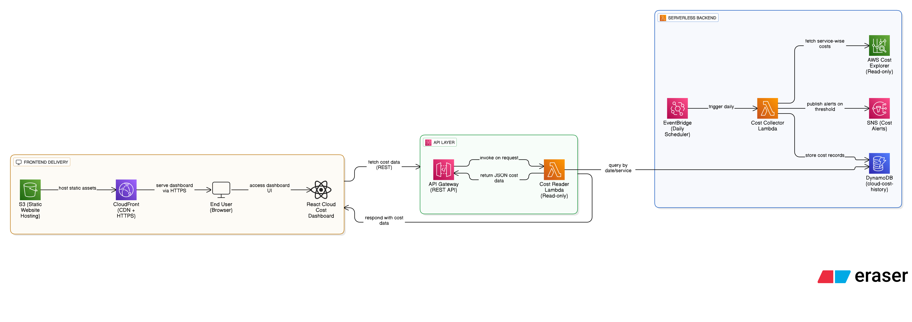

# ☁️ Cloud Cost Intelligence Platform (AWS FinOps Project)
AWS FinOps | Serverless | Infrastructure as Code

A production-grade, serverless cloud cost monitoring platform built on AWS that automatically tracks daily service-wise cloud costs, stores historical data, exposes a read-only API, and visualizes spending through a modern web dashboard — all provisioned using Terraform (IaC).

This project demonstrates real-world cloud engineering, FinOps cost governance, and secure, scalable architecture.

# 🎯 Project Objective
-To design and implement a fully automated, cloud-native system that:

-Collects AWS cost data daily

-Stores service-wise historical cost records

-Alerts stakeholders when spending exceeds thresholds

-Exposes cost data through an API

-Visualizes costs in a user-friendly dashboard

-Uses Infrastructure as Code for the entire lifecycle

# 🏗️ Architecture

Amazon EventBridge (Daily Scheduler) -> AWS Lambda (Cost Collector) -> AWS Cost Explorer -> Amazon DynamoDB (Cost History Storage) -> Amazon SNS (Email Alerts) -> API Gateway (Read-Only API) -> AWS Lambda (Cost Reader) -> React Dashboard (S3 + CloudFront)

# 🧰 Tech Stack

-Cloud & Backend

 -AWS Lambda – Serverless compute

 -AWS Cost Explorer – Cost analytics

 -Amazon DynamoDB – Persistent cost storage

 -Amazon EventBridge – Daily automation

 -Amazon SNS – Email notifications

 -Amazon API Gateway – Read-only REST API

 -Amazon CloudWatch – Logging & monitoring

-Frontend

 -React (Vite)

 -Chart.js

 -Custom CSS

-Infrastructure & Tooling

 -Terraform – Infrastructure as Code

 -Python (boto3) – AWS SDK

 -AWS CLI

# ⚙️ Terraform Infrastructure Breakdown

All cloud resources are provisioned using Terraform, following modular and production-aligned practices.

| File             | Responsibility                        |
| ---------------- | ------------------------------------- |
| `provider.tf`    | AWS provider & region configuration   |
| `variables.tf`   | Centralized environment configuration |
| `iam.tf`         | Least-privilege IAM roles & policies  |
| `lambda.tf`      | Lambda function definitions           |
| `eventbridge.tf` | Daily cost collection scheduler       |
| `dynamodb.tf`    | Cost history storage                  |
| `sns.tf`         | Budget alert notifications            |
| `api_gateway.tf` | Read-only cost API                    |
| `frontend_s3.tf` | Static frontend hosting               |
| `cloudfront.tf`  | CDN + HTTPS delivery                  |

# 🔐 Security Design (IAM)

-Fine-grained IAM policies

-Separate roles for:

-Cost collection

-Cost reading (API)

-Read-only access to Cost Explorer

-Write-only access to DynamoDB

-Publish-only access to SNS

-CloudWatch logging permissions only where required

-Follows least-privilege principles

# 🧠 Lambda Function Logic

-Cost Collector Lambda

-Fetches yesterday’s AWS cost data

-Groups costs by AWS service

-Stores records in DynamoDB

-Calculates total daily spend

-Triggers SNS alert if threshold exceeded

-Cost Reader Lambda

-Queries DynamoDB by date

-Handles DynamoDB Decimal serialization

-Returns clean JSON responses

-Enables browser-safe CORS access

# 🌐 API Layer

-Endpoint
GET /costs?date=YYYY-MM-DD

-Features

 -Read-only access to historical cost data

 -JSON response format

 -Designed for UI consumption

 -Secure Lambda invocation via API Gateway

# 🖥️ Frontend — Cloud Cost Dashboard

A modern React-based dashboard for visualizing AWS costs.

Features

-Date-based cost selection

-Service-wise cost breakdown

-Total daily spend calculation

-Interactive bar chart

-Tabular cost view

-Service-level filtering

-Loading, empty, and error states

-Responsive UI

# 🚀 Frontend Deployment (Pure Cloud + IaC)

The frontend is deployed using a production-grade static hosting architecture.

Architecture:

User Browser (HTTPS) -> CloudFront (Global CDN) -> Amazon S3 (Static React Build)

Highlights

-Global CDN via CloudFront

-HTTPS enabled by default

-SPA routing support

-No servers, no runtime management

-Fully provisioned using Terraform

# 🔁 Deployment Workflow

-Build frontend
 -npm run build

-Provision infrastructure
 -terraform apply

-Upload frontend assets
 -aws s3 sync dist/ s3://<bucket-name> --delete

# 🚀 Key Features

- Fully automated daily cost tracking

- Service-wise cost breakdown

- Historical cost persistence

- Budget threshold email alerts

- Serverless & scalable design

- Secure IAM configuration

- API + Dashboard integration

- 100% Infrastructure as Code

# 📌 Real-World Use Cases

-FinOps cost monitoring

-Cloud budget governance

-Cost anomaly detection

-DevOps & SRE cost visibility

-Cloud expense auditing

# 🏁 Project Status

- Fully implemented

- Fully documented

- Production-ready

- Cost-safe (IaC teardown supported)
